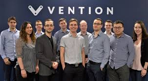
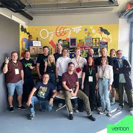

## Welcome to the Ventionss company 👋

  
<!-- 
 -->

<!--  -->

         

## About Us

Ventionss is an innovative IT company based in New York, US, specializing in cutting-edge software solutions and digital transformation services.
 

Founded in 2023, Ventionss aims to empower businesses by leveraging advanced technologies such as artificial intelligence, machine learning, and cloud computing.
 

The company focuses on providing tailored solutions that enhance operational efficiency, improve customer engagement, and drive growth for its clients across various industries. 
 
With a team of experienced professionals, Ventionss is dedicated to delivering high-quality software products, including custom applications, data analytics tools, and enterprise resource planning (ERP) systems.
 

Ventionss prides itself on its collaborative approach, working closely with clients to understand their unique challenges and develop innovative strategies that align with their business goals. By fostering a culture of creativity and continuous improvement, Ventionss is committed to helping organizations navigate the complexities of the digital landscape and achieve sustainable success.
  

